# 📖📖 Flutter Reading App 

The [Feedbooks API](http://www.feedbooks.com/api) was used to fetch books.
 
 
<a href="http://download1523.mediafire.com/47ofh2ic5wdg/tk77cflsp5alb6j/app-release.apk"></img></a>
 
Please star⭐ the repo if you like what you see😉.

## 💻 Requirements
* Any Operating System (ie. MacOS X, Linux, Windows)
* Any IDE with Flutter SDK installed (ie. IntelliJ, Android Studio, VSCode etc)
* A little knowledge of Dart and Flutter
* A brain to think 🤓🤓

## ✨ Features
- [x] Download eBooks.
- [x] Read eBooks.
- [x] Favorites.
- [x] Dark Mode
- [x] Swipe to delete downloads.

## 📸 ScreenShots

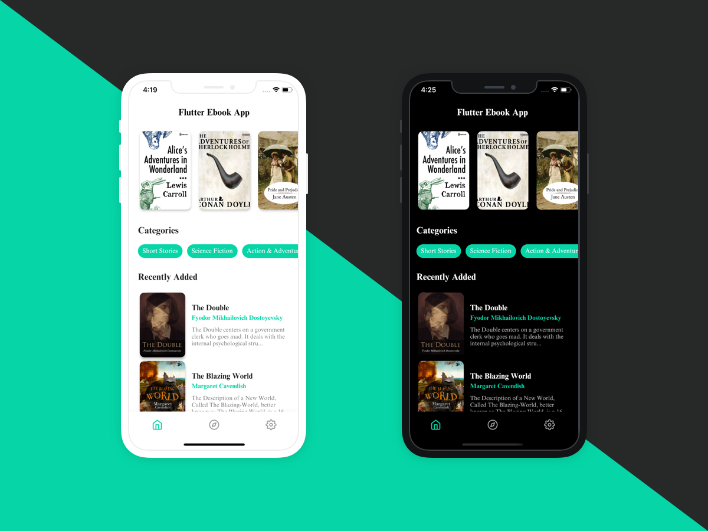

| Light| Dark|
|------|-------|
|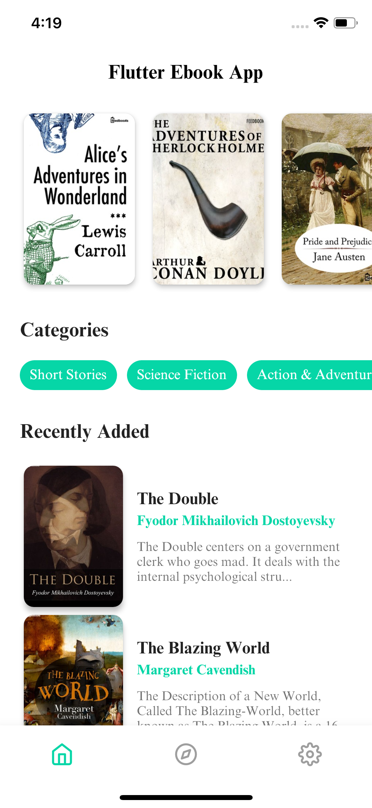|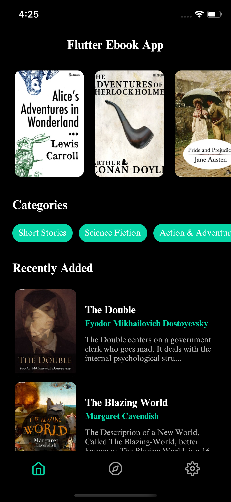|
|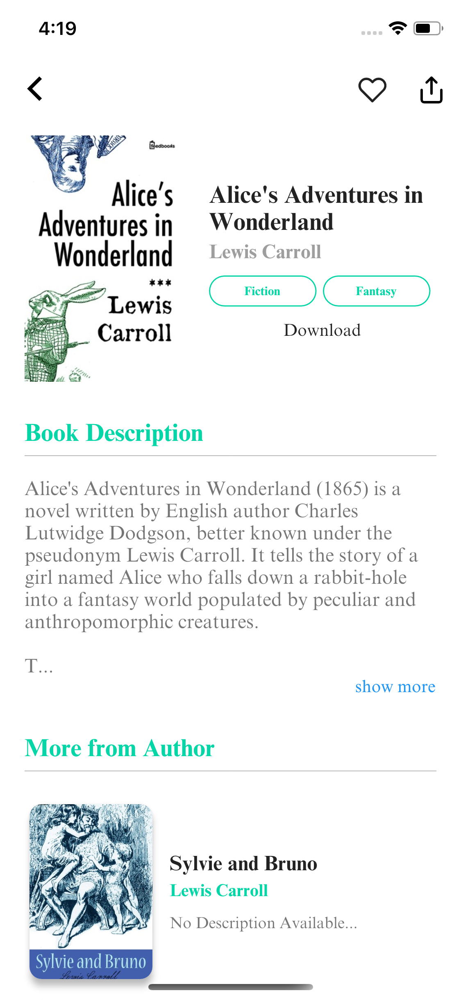|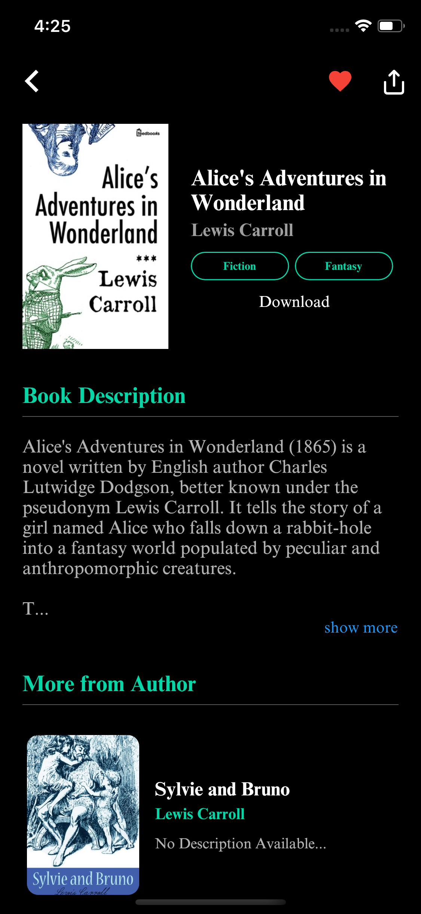|
|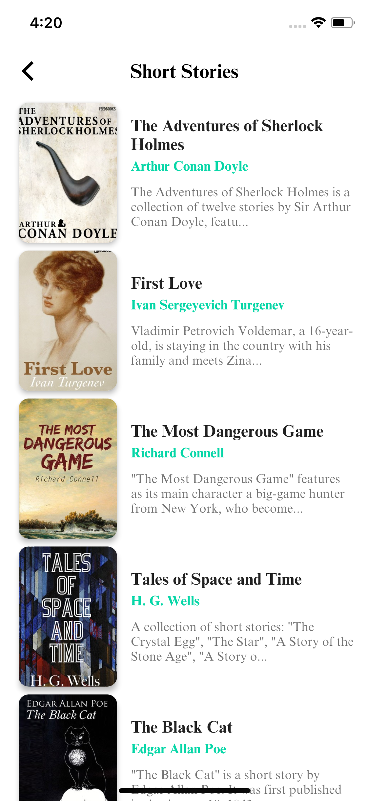|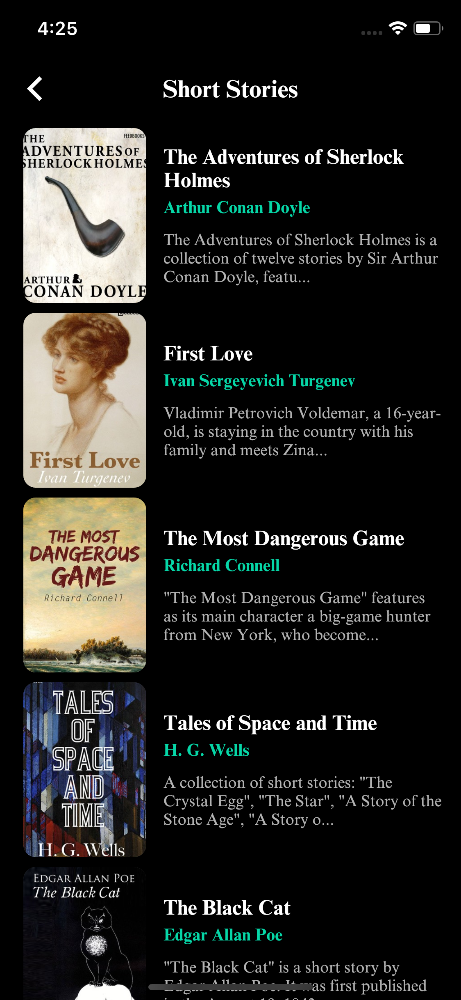|
|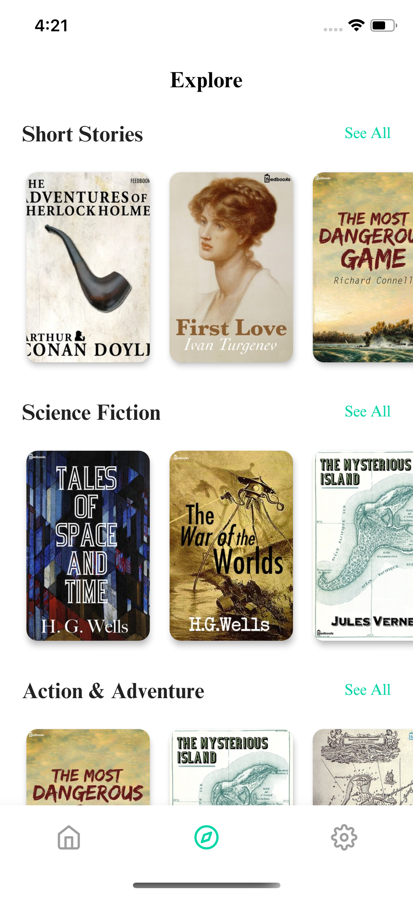|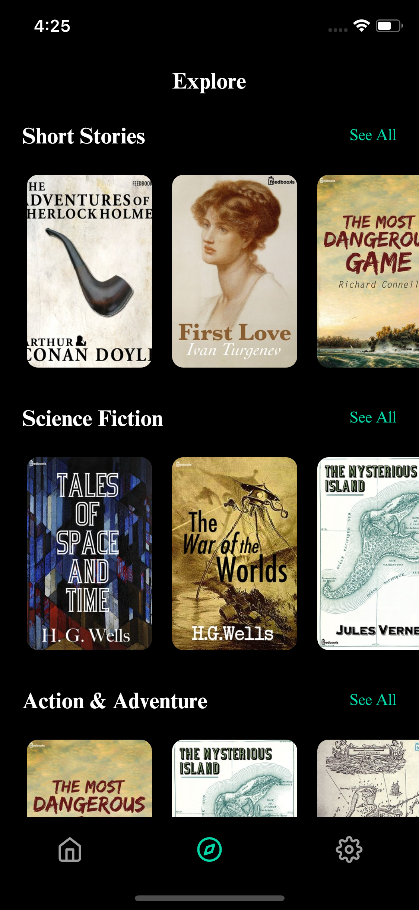|
|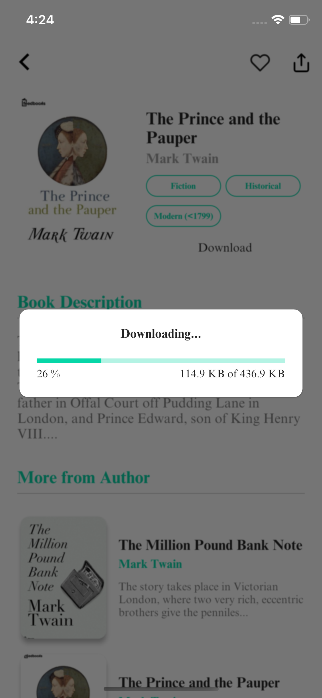|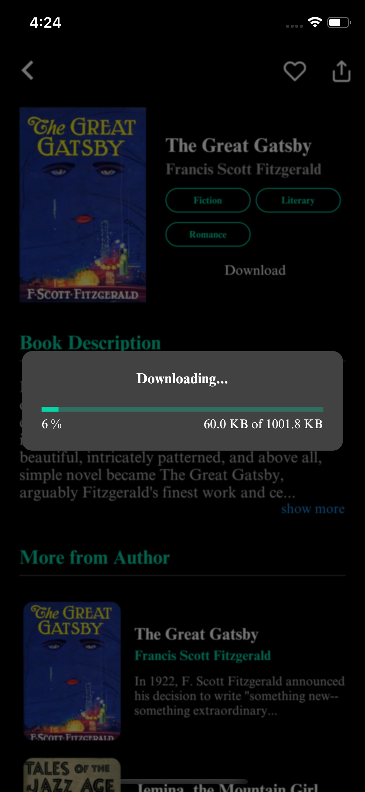|
|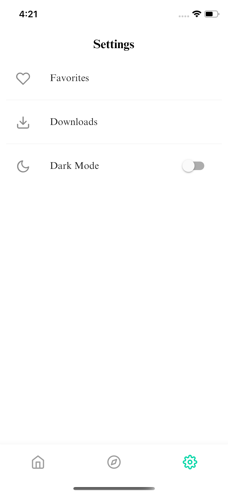|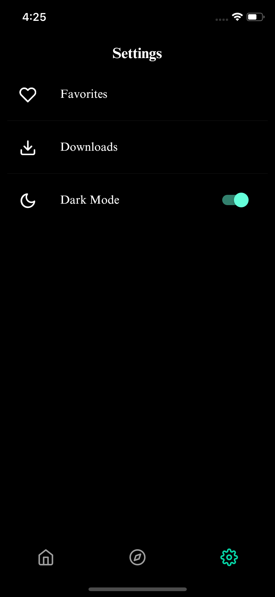|
|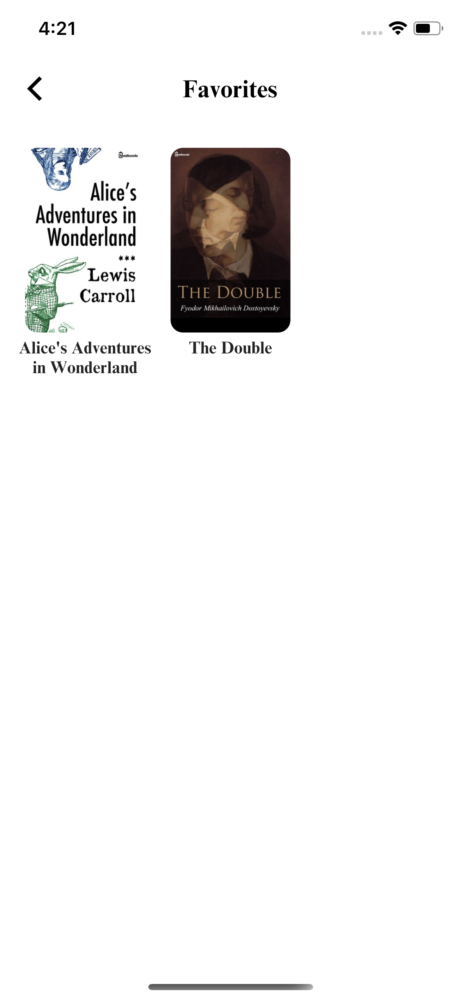|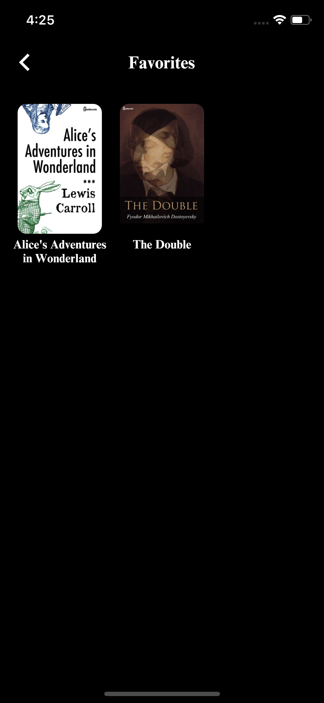|
